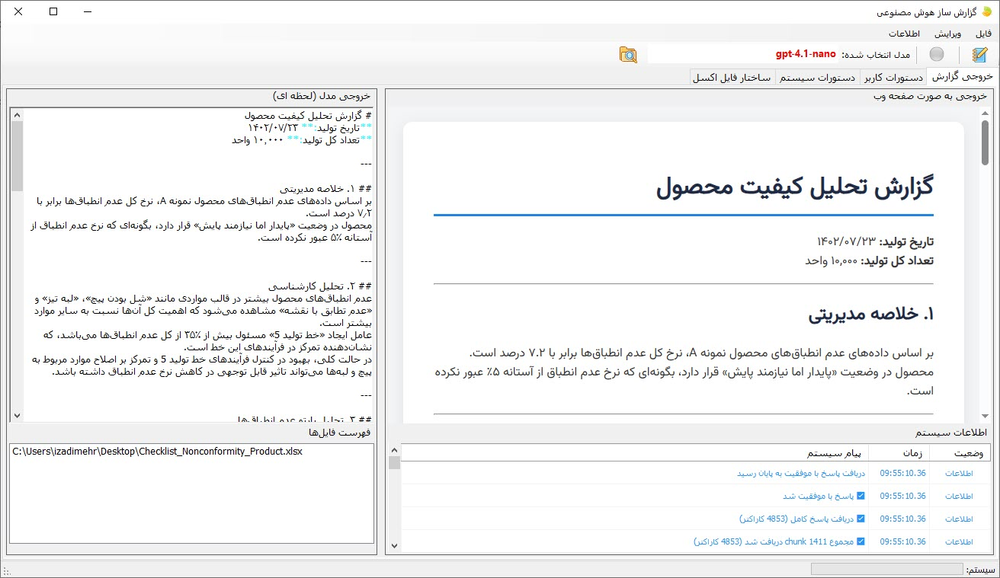

# 🧠 AI Prompt‑Based Report Generator (Sample Project)

**یک پروژه نمونه برای آشنایی عملی با هوش مصنوعی و طراحی پرامپت‌ها**

---

## 📌 معرفی پروژه

این پروژه یک **نمونه آموزشی (Sample Project)** است که با هدف  
**آشنایی عملی با نحوه استفاده از APIهای هوش مصنوعی و طراحی Promptها** توسعه داده شده است.

نرم‌افزار نشان می‌دهد که چگونه می‌توان:
- داده‌های ساخت‌یافته (مانند فایل اکسل)
- دستورات متنی (System Prompt و User Prompt)
- و یک مدل هوش مصنوعی

را ترکیب کرد و به یک **خروجی متنی تحلیلی و ساختاریافته** رسید.

> ⚠️ این پروژه **نرم‌افزار حرفه‌ای کیفیت یا محصول نهایی صنعتی نیست**  
> و صرفاً برای **یادگیری، آزمایش و نمونه‌سازی** ارائه شده است.

---

## 🎯 هدف اصلی پروژه

- آموزش نحوه کار با **AI APIs**
- آشنایی با مفهوم **System Prompt / User Prompt**
- نشان دادن تأثیر ساختار پرامپت بر خروجی
- نمونه‌ای ساده از تولید گزارش مبتنی بر داده
- بستری برای تست و توسعه ایده‌های AI‑محور

---

## ✨ آنچه این پروژه نشان می‌دهد

- ✅ اتصال به سرویس‌های مختلف هوش مصنوعی  
- ✅ استفاده از API Key کاربر
- ✅ خواندن داده از فایل اکسل
- ✅ ارسال داده‌ها به مدل هوش مصنوعی
- ✅ کنترل خروجی فقط از طریق Prompt
- ✅ تولید گزارش متنی ساختاریافته

---

## 🚫 آنچه این پروژه نیست

برای شفافیت کامل:

- ❌ نرم‌افزار حرفه‌ای مدیریت کیفیت
- ❌ ابزار قابل استقرار در محیط صنعتی
- ❌ جایگزین تحلیل کارشناسی یا تصمیم مدیریتی
- ❌ مبتنی بر استاندارد رسمی یا اعتبارسنجی‌شده

---

## 🧩 پیش‌نیازها

برای اجرای پروژه:

1. 🔑 دریافت **API Key** از یکی از سرویس‌دهنده‌های هوش مصنوعی  
   (OpenAI، Anthropic، Google و …)
2. 📄 یک فایل اکسل نمونه (مثلاً چک‌لیست یا داده‌های تستی)
3. 📝 نوشتن Prompt توسط کاربر

---

## ⚙️ روند کلی کار

1. وارد کردن اطلاعات API و کلید دسترسی  
2. انتخاب فایل اکسل داده
3. تعریف:
   - **System Prompt** (نقش و قوانین مدل)
   - **User Prompt** (درخواست خروجی)
4. ارسال داده و دستور به مدل هوش مصنوعی
5. مشاهده خروجی تولیدشده

---

## 🧠 نقش Promptها در این پروژه

این پروژه عمداً تمرکز اصلی را روی **Prompt Engineering** گذاشته است:

### System Prompt
- تعریف نقش مدل (مثلاً تحلیل‌گر)
- تعیین محدودیت‌ها و قالب خروجی
- مشخص کردن ساختار گزارش

### User Prompt
- تعریف خواسته کاربر
- تعیین تمرکز تحلیل
- تغییر نوع خروجی بدون تغییر کد

> با تغییر Prompt‌ها، خروجی کاملاً متفاوت می‌شود  
> بدون آن‌که منطق برنامه تغییر کند.

---

## 📊 داده‌های ورودی

- فایل اکسل با ساختار آزاد
- داده‌ها صرفاً به‌عنوان **نمونه آموزشی** استفاده می‌شوند
- هیچ الزام یا استاندارد خاصی برای داده‌ها وجود ندارد

---

## 📄 خروجی

- خروجی متنی تولیدشده توسط هوش مصنوعی
- بسته به Prompt می‌تواند:
  - گزارشی ساده
  - تحلیلی
  - یا کاملاً آزمایشی باشد

---

## 🎓 مناسب چه کسانی است؟

- علاقه‌مندان به هوش مصنوعی
- توسعه‌دهندگان
- دانشجویان
- افرادی که می‌خواهند Prompt Engineering را **عملاً** یاد بگیرند
- کسانی که می‌خواهند قبل از ساخت محصول واقعی، نمونه بسازند

---

## 💡 نکته آموزشی مهم

قدرت اصلی این پروژه در **کد نیست**، بلکه در:

> ✨ نحوه طراحی Prompt و تعامل با مدل هوش مصنوعی است

---

## 📦 وضعیت پروژه

- ✅ پروژه نمونه (Demo / Sample)
- ✅ قابل توسعه و تغییر
- ❗ فاقد تضمین برای استفاده عملی یا صنعتی
